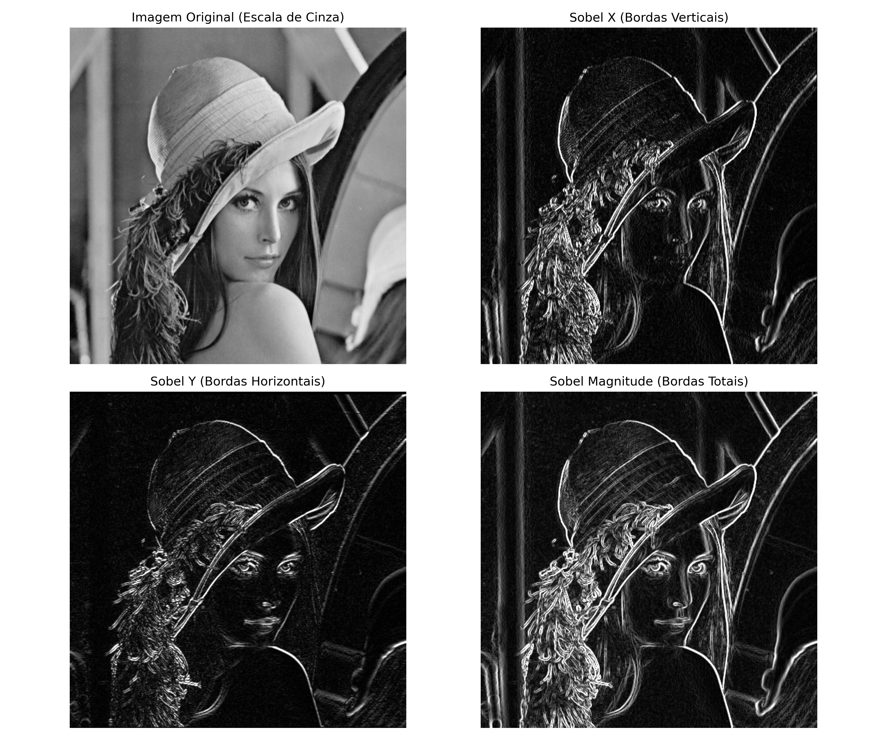

# Filtro de Sobel para Detecção de Bordas (OpenCV)

Este diretório contém uma implementação prática do **Filtro de Sobel** utilizando a biblioteca OpenCV em Python. O Filtro de Sobel é um dos operadores clássicos mais importantes em Processamento de Imagens Digitais e Visão Computacional, sendo amplamente utilizado para a **detecção de bordas** e **segmentação básica**.

---

## 📐 O que é o Filtro de Sobel?

O operador Sobel calcula uma aproximação do **gradiente de intensidade** da imagem em cada ponto. Ele combina a suavização Gaussiana e a diferenciação para reduzir ruídos e extrair as bordas mais salientes.

O cálculo é baseado na convolução da imagem original (em escala de cinza) com duas máscaras (kernels) de tamanho $3 \times 3$, uma para a direção horizontal (X) e outra para a direção vertical (Y):

### Kernels de Convolução

*   **Eixo X (Bordas Verticais - $G_x$):** Detecta transições horizontais de intensidade.
    
    $$G_x = \begin{bmatrix} -1 & 0 & +1 \\ -2 & 0 & +2 \\ -1 & 0 & +1 \end{bmatrix} * I$$

*   **Eixo Y (Bordas Horizontais - $G_y$):** Detecta transições verticais de intensidade.
    
    $$G_y = \begin{bmatrix} -1 & -2 & -1 \\ 0 & 0 & 0 \\ +1 & +2 & +1 \end{bmatrix} * I$$

### Magnitude do Gradiente

Para obter a força total da borda em cada pixel, combinamos as duas componentes calculando a magnitude do gradiente:

$$G = \sqrt{G_x^2 + G_y^2}$$

No código OpenCV, essa etapa é simplificada com a função `cv2.magnitude(sobel_x, sobel_y)`.

---

## 📂 Estrutura de Arquivos Gerada

Ao executar o script, a seguinte estrutura de arquivos é criada:

```text
Metodos de Segmentação com OpenCV/
│
├── exemplo.py               # Código fonte principal
├── README.md                # Esta documentação
│
├── imagens/
│   └── Lenna.png            # Imagem de teste baixada automaticamente
│
└── resultados/
    ├── sobel_x.png          # Bordas verticais detectadas
    ├── sobel_y.png          # Bordas horizontais detectadas
    ├── sobel_magnitude.png  # Bordas completas (magnitude)
    └── comparativo_sobel.png # Painel com o comparativo de todas as etapas
```

---

## 💻 Como Rodar o Exemplo

1. Navegue até este diretório:
   ```bash
   cd "Processamento de Imagens com Machine Learning/Métodos de Segmentação Com OpenCV/Metodos de Segmentação com OpenCV"
   ```

2. Execute o script utilizando o ambiente virtual Python do projeto:
   ```bash
   ../../../.venv/Scripts/python.exe exemplo.py
   ```

---

## 📊 Resultado Esperado

O script gerará o arquivo comparativo `resultados/comparativo_sobel.png`, agrupando as etapas do processo:


