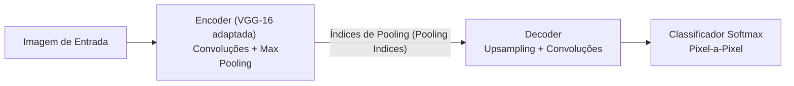
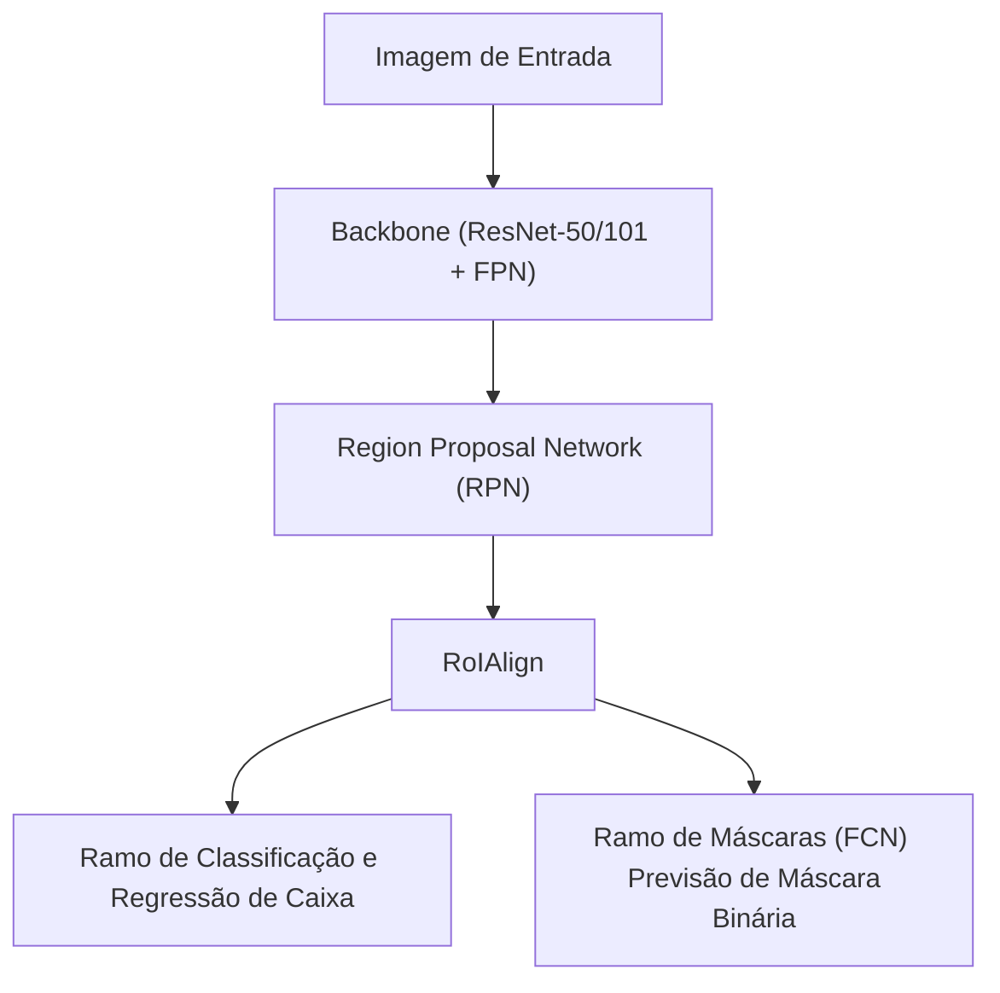

# 📚 Aula Teórica: Métodos de Segmentação Semântica e de Instância

Este documento apresenta as anotações teóricas detalhadas sobre a **Segmentação Semântica** e a **Segmentação de Instância**, abordando os conceitos fundamentais, a diferença prática entre as tarefas e o funcionamento detalhado das arquiteturas **SegNet** e **Mask R-CNN**.

---

## 🔍 1. Tipos de Segmentação de Imagem

No campo da Visão Computacional moderna, a segmentação consiste no processo de classificar elementos de uma imagem ao nível de pixel. Dependendo do objetivo final da aplicação, dividimos essa tarefa em três categorias principais:

1. **Segmentação Semântica (Semantic Segmentation):**
   * **Objetivo:** Classificar cada pixel da imagem em uma categoria pré-definida (ex: pedestre, estrada, carro, calçada, céu).
   * **Particularidade:** Não diferencia instâncias individuais pertencentes à mesma classe. Se houver cinco pessoas lado a lado, todos os pixels correspondentes a elas receberão o mesmo rótulo e cor ("Pessoa").
   * **Arquiteturas comuns:** *SegNet*, *U-Net*, *DeepLab*.

2. **Segmentação de Instância (Instance Segmentation):**
   * **Objetivo:** Detectar e segmentar individualmente cada objeto de interesse na imagem.
   * **Particularidade:** Combina a detecção de objetos (localizar e classificar instâncias com caixas delimitadoras) com a segmentação semântica (colorir apenas os pixels pertencentes àquele objeto específico dentro da caixa). Diferentes indivíduos da mesma classe recebem identificações (IDs) e cores distintas.
   * **Arquiteturas comuns:** *Mask R-CNN*, *YOLACT*.

3. **Segmentação Panóptica (Panoptic Segmentation):**
   * **Objetivo:** Unificar a segmentação semântica e de instância sob um mesmo pipeline.
   * **Particularidade:** Divide a imagem entre "stuff" (elementos de fundo sem forma definida, como céu, grama e asfalto - tratados via segmentação semântica) e "things" (objetos contáveis individualizáveis, como pessoas, carros e postes - tratados via segmentação de instância).

---

## 🏗️ 2. SegNet (Semantic Segmentation)

Desenvolvida pelo grupo de Visão Computacional da Universidade de Cambridge, a **SegNet** é uma arquitetura de rede neural convolucional totalmente convolucional (FCN) voltada especificamente para a **segmentação semântica** eficiente em aplicações de tempo real, como direção autônoma e robótica.

### 📐 Arquitetura Encoder-Decoder
A SegNet é composta por duas grandes partes simétricas:

1. **Encoder (Codificador):**
   * Baseia-se nas 13 primeiras camadas convolucionais da clássica rede **VGG-16**.
   * Sua função é extrair mapas de características de alto nível, reduzindo progressivamente a resolução espacial da imagem através de filtros de convolução e camadas de **Max Pooling** ($2 \times 2$).
2. **Decoder (Decodificador):**
   * Possui uma estrutura perfeitamente espelhada em relação ao encoder.
   * Sua função é restaurar a resolução espacial original a partir das características compactadas para que o classificador final classifique cada pixel individualmente.

### 💡 A Inovação dos Índices de Max Pooling (Pooling Indices)
Ao realizar o downsampling (redução de resolução) com Max Pooling tradicional, as redes normais descartam as informações espaciais sobre onde exatamente estavam os maiores valores ativados. Para resolver isso, outras arquiteturas (como a U-Net) utilizam conexões de salto (*skip connections*) que copiam mapas completos de características do encoder para o decoder, o que consome bastante memória.

A **SegNet** inova com o seguinte mecanismo:
* Durante a fase de Max Pooling no **Encoder**, a rede salva apenas as **coordenadas (índices)** do pixel de maior valor dentro de cada janela de pooling $2 \times 2$.
* No **Decoder**, em vez de aprender filtros de upsampling complexos ou copiar blocos inteiros de dados de alta resolução, a rede realiza um **upsampling não linear** posicionando os valores reconstruídos exatamente nos mesmos índices salvos anteriormente.
* O restante da janela do pixel de saída é preenchido com zeros. Convoluções subsequentes suavizam e preenchem esses mapas.

> [!OBS]
> **Vantagem:** Essa técnica elimina a necessidade de aprender parâmetros extras de upsampling ou armazenar mapas de ativação pesados na memória, reduzindo expressivamente o consumo de VRAM e permitindo um processamento em tempo real extremamente eficiente.

---

## 🎯 3. Mask R-CNN (Instance Segmentation)

A **Mask R-CNN** é um modelo de Deep Learning estado da arte proposto por Kaiming He e colaboradores (Facebook AI Research - FAIR) para **segmentação de instância**.

### ⚙️ Evolução da Arquitetura
Para compreender a Mask R-CNN, é fundamental analisar sua linhagem evolucionária:
1. **R-CNN:** Extrai regiões candidatas por algoritmos de segmentação clássica (ex: Selective Search), passa cada proposta individualmente por uma CNN e classifica. Extremamente lento.
2. **Fast R-CNN:** Passa a imagem inteira pela CNN uma única vez e projeta as regiões propostas no mapa de características final, usando **RoIPool** para extrair vetores de tamanho fixo.
3. **Faster R-CNN:** Introduz uma rede neural integrada chamada **Region Proposal Network (RPN)** para sugerir regiões candidatas diretamente no mapa de características, tornando todo o processo de detecção unificado e em tempo real.
4. **Mask R-CNN:** Estende a Faster R-CNN adicionando uma ramificação paralela dedicada a prever a máscara de segmentação em nível de pixel.

### 🧩 Componentes Chave da Mask R-CNN

*   **Backbone:** Geralmente uma rede **ResNet-50** ou **ResNet-101** combinada com **FPN (Feature Pyramid Network)** para extrair características em múltiplas escalas de resolução.
*   **RPN (Region Proposal Network):** Propõe caixas delimitadoras candidatas onde há grande probabilidade de conter um objeto.
*   **RoIAlign (Alinhamento de Região de Interesse):**
    *   Nas versões anteriores (Faster R-CNN), a operação de **RoIPool** arredondava valores de pixels para coordenadas discretas (quantização), o que causava pequenos desvios de alinhamento espacial.
    *   O **RoIAlign** remove essa quantização e utiliza **interpolação bilinear** para extrair representações contínuas e exatas das regiões de interesse, preservando a exatidão espacial no nível do pixel que é crucial para traçar as máscaras.
*   **Ramos de Saída:**
    *   **Classificação:** Prevê a classe do objeto (ex: pessoa, carro, garrafa).
    *   **Bounding Box (Regressão):** Ajusta as coordenadas da caixa delimitadora ao redor do objeto.
    *   **Máscara (Mask):** Uma rede totalmente convolucional (FCN) que prevê uma máscara binária de tamanho $K \times m \times m$ (onde $K$ é o número de classes) para desenhar a silhueta exata do objeto.

> [!IMPORTANT]
> **Desacoplamento de Classe e Máscara:** Diferente de outros modelos que tentam classificar e segmentar de forma acoplada, o ramo de máscara prevê uma máscara binária para cada classe de forma independente, e o ramo de classificação define qual dessas máscaras deve ser sobreposta. Isso simplifica o treino e gera bordas muito mais limpas.

---

## 📊 Tabela Comparativa: SegNet vs. Mask R-CNN

| Característica | SegNet | Mask R-CNN |
| :--- | :--- | :--- |
| **Tipo de Segmentação** | Semântica (Pixel a pixel) | Instância (Objeto por objeto) |
| **Tarefa Principal** | Classificar cada pixel da imagem | Detectar, classificar e delimitar a silhueta de cada objeto |
| **Diferenciação de Objetos** | Não (carros encostados formam um único bloco) | Sim (cada carro tem uma identidade e cor distintas) |
| **Arquitetura Base** | Encoder-Decoder (derivada da VGG-16) | Backbone (ResNet + FPN) + RPN + FCN |
| **Resolução de Detalhes** | Boa (usando índices de Max Pooling) | Altíssima (usando RoIAlign com interpolação bilinear) |
| **Consumo de Memória** | Muito Baixo / Eficiente | Moderado a Alto |
| **Aplicações Comuns** | Segmentação de vias, calçadas, sensores de carros autônomos | Contagem de objetos, robótica cirúrgica, robótica de precisão |
