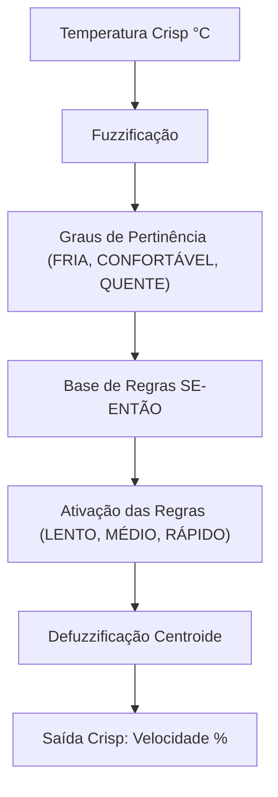

# Métodos de Otimização de Aprendizado - Lógica Fuzzy (Sistemas Nebulosos)

Este módulo faz parte da trilha **Teoria do Aprendizado Estatístico** dentro da **Formação Machine Learning Specialist**. Ele é dedicado ao estudo e à implementação prática de algoritmos baseados em **Lógica Fuzzy (Lógica Nebulosa)**.

A Lógica Fuzzy permite que variáveis assumam graus de pertinência contínuos no intervalo $[0, 1]$, diferentemente da lógica booleana tradicional (onde os valores são estritamente $0$ ou $1$). Essa abordagem é ideal para modelar incertezas, imprecisões e termos da linguagem natural (como "frio", "confortável" ou "quente").

---

## 📂 Estrutura do Diretório

O diretório está estruturado da seguinte forma:

*   [fuzzy_algoritmo.py](file:///c:/Users/moliv/Documents/Formacao-Machine-Learning-Specialist/Teoria%20do%20Aprendizado%20Estat%C3%ADstico/M%C3%A9todos%20de%20Otimiza%C3%A7%C3%A3o%20de%20Aprendizado/fuzzy_algoritmo.py): Script Python principal que implementa o sistema de controle de temperatura fuzzy do início ao fim.
*   **[resultado/](file:///c:/Users/moliv/Documents/Formacao-Machine-Learning-Specialist/Teoria%20do%20Aprendizado%20Estat%C3%ADstico/M%C3%A9todos%20de%20Otimiza%C3%A7%C3%A3o%20de%20Aprendizado/resultado)**: Diretório contendo as saídas geradas pelas execuções dos testes do algoritmo.
    *   [resultado_fuzzy.txt](file:///c:/Users/moliv/Documents/Formacao-Machine-Learning-Specialist/Teoria%20do%20Aprendizado%20Estat%C3%ADstico/M%C3%A9todos%20de%20Otimiza%C3%A7%C3%A3o%20de%20Aprendizado/resultado/resultado_fuzzy.txt): Relatório gerado com os graus de pertinência obtidos, regras aplicadas e a velocidade resultante do ventilador para cada cenário de teste.

---

## 🛠️ Funcionamento do Sistema Fuzzy Implementado

O script resolve um problema clássico de controle: **ajustar a velocidade de um ventilador (%) com base na temperatura atual do ambiente (°C)**.



### 1. Funções de Pertinência (Membership Functions)
As funções de pertinência mapeiam os valores reais (crisp) de entrada para valores no intervalo $[0, 1]$. O script implementa:
*   **Triangular**: `pertinencia_triangular(x, a, b, c)`
*   **Trapezoidal**: `pertinencia_trapezoid(x, a, b, c, d)`
*   **Gaussiana**: `pertinencia_gaussiana(x, media, sigma)`

### 2. Conjuntos Fuzzy de Entrada (Temperatura)
A temperatura de entrada é mapeada em três conjuntos linguísticos:
*   ❄️ **FRIA**: Função Trapezoidal com parâmetros $[0, 0, 15, 25]$
*   🍃 **CONFORTÁVEL**: Função Triangular com parâmetros $[15, 22, 30]$
*   🔥 **QUENTE**: Função Trapezoidal com parâmetros $[25, 32, 50, 50]$

### 3. Base de Regras (Inferência)
As seguintes regras lógicas de controle são aplicadas:
1.  **SE** temperatura é **FRIA** $\rightarrow$ velocidade do ventilador é **LENTO** *(centro de gravidade: 20%)*
2.  **SE** temperatura é **CONFORTÁVEL** $\rightarrow$ velocidade do ventilador é **MÉDIO** *(centro de gravidade: 50%)*
3.  **SE** temperatura é **QUENTE** $\rightarrow$ velocidade do ventilador é **RÁPIDO** *(centro de gravidade: 90%)*

### 4. Defuzzificação (Método do Centroide)
Após aplicar a base de regras, o valor nebuloso resultante é transformado de volta em um valor real (crisp) de velocidade do ventilador utilizando o método do **Centro de Gravidade (COG)**:

$$\text{Saída Crisp} = \frac{\sum (\mu_i \times c_i)}{\sum \mu_i}$$

Onde:
*   $\mu_i$ representa o grau de ativação de cada regra.
*   $c_i$ é o centro de gravidade correspondente ao conjunto de saída ($Lento = 20\%$, $Médio = 50\%$, $Rápido = 90\%$).

---

## 🚀 Como Executar o Script

Certifique-se de estar com o ambiente virtual ativado no seu terminal e execute o arquivo Python:

```bash
python "Teoria do Aprendizado Estatístico/Métodos de Otimização de Aprendizado/fuzzy_algoritmo.py"
```

O script executará testes automáticos para várias temperaturas ($5^\circ\text{C}$, $12^\circ\text{C}$, $18^\circ\text{C}$, $22^\circ\text{C}$, $26^\circ\text{C}$, $30^\circ\text{C}$, $38^\circ\text{C}$, $45^\circ\text{C}$), exibindo os resultados detalhados no console e salvando o relatório completo em `resultado/resultado_fuzzy.txt`.

---

## 🌟 Vantagens da Lógica Fuzzy em Inteligência Artificial
*   **Interpretabilidade**: As regras são declaradas em linguagem natural, facilitando a auditoria e a compreensão do comportamento do sistema.
*   **Tratamento de Incerteza**: Modela imprecisões e termos subjetivos sem exigir modelagens matemáticas altamente complexas ou grandes bases de dados históricos para treinamento.
*   **Flexibilidade**: Serve como fundação para o desenvolvimento de sistemas híbridos sofisticados, como o ANFIS (*Adaptive Neuro-Fuzzy Inference System*), combinando o aprendizado de redes neurais com a interpretabilidade fuzzy.
